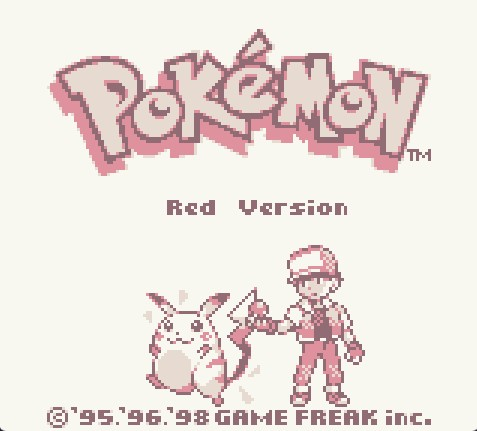

## **An M Cycle Accurate Gameboy Emulator Programmed in Rust**

## Currently In Development
 - The 2 mains goals of this project are to make a fairly accurate emulator and also learn the fundamentals of rust. It won't be the most accurate gameboy emulator in the world but I do want it to pass as many well known test roms as possible (blargg, mooneye, dmg-acid2, etc).
 - The main feature the emulator is currently lacking is audio but I do plan to add it
 - Skip to [**Testing**](Testing) to see the current test roms its passes
 - Skip to [**Current Features**](Current-Features) to see what is currently emulated
 - Skip to [**Next Features**](Next-Features) to see what's planned

## **Screenshots**

## **Button Mappings**
#### **Gameboy Button ==> Physical Keyboard**

Up ==> Up Arrow

Down ==> Down Arrow

Left ==> Left Arrow

Right ==> Right Arrow

A ==> F

B ==> D

Start ==> Right Shift

Select ==> Enter/Return

## **Testing**
Currently Passes the Following Test Roms:
 - **Blargg Tests**
   - cpu_instrs
   - instr_timing
   - mem_timing/mem_timing2
   - halt_bug
 - **dmg-acid2** (https://github.com/mattcurrie/dmg-acid2)
 - **Emulator-Only** (Mooneye - mts-20220522-1522-55c535c)
    - `MBC1`
    - `MBC5`
 - **Acceptance** (Mooneye - mts-20220522-1522-55c535c)
    - oam_dma/
    - bits/
    - instr/
    - timer/
    - General (Dont know what to call these)
         - boot_div-dmgABCmgb
         - boot_hwio-dmgABCmgb
         - boot_reg-dmgABC
         - call_timing2
         - call_cc_timing2
         - di_timing-GS
         - div_timing
         - ei_sequence
         - ei_timing
         - halt_ime0_ei
         - halt_ime0_nointr_timing
         - halt_ime1_timing
         - halt_ime1_timing2-GS
         - if_ie_registers
         - intr_timing
         - pop_timing
         - push_timing
         - rapid_di_ei
         - reti_intr_timing
         - rst_timing
         - oam_dma_restart
         - oam_dma_timing
         - oam_dma_start
         - add_sp_e_timing
         - call_timing
         - call_cc_timing
         - jp_cc_timing
         - jp_timing
         - ld_hl_sp_e_timing
         - ret_cc_timing
         - ret_timing
         - reti_timing
 - **Manual-Only** (Mooneye - mts-20220522-1522-55c535c)
    - sprite_priority (well.. as far as my eyes can tell)
 - **rtc3test**
    - basic tests (https://github.com/aaaaaa123456789/rtc3test/blob/master/tests.md#basic-tests)
 - **Miscalleneous**
    - lycscx.gb
    - lycscy.gb

Tests I care about that are failing from Mooneye Acceptance:
 - ppu/ - All of them fail :(

## **Features**

#### **Current Features**
 - Memory Bank Controllers
   - None
   - MBC1 (Multicart Not implemented)
   - MBC3 with RTC3 (Passes basic rtc3 test)
   - MBC5
 - CPU
 - Haltbug
 - Interrupts
 - DMA Transfer
 - Stat Blocking (Need to Test)
 - DMG Stat Quirk/Bug (Need to test)
 - PPU (Doesnt extend mode 3 properly)

#### **Next Features**
 - Pass as many of Mooneye's Acceptance Tests as possible
 - Sound
 - Implement Extending Mode 3 of PPU
 - Pass as many of Mealybug Tearoom Tests as possible
 - MBC2

#### **Maybe Features**
 - CGB Support

#### **Not Planned Features**
 - OAM Corruption Bug
 - MBC4, and the more obscure ones
 - Peripherals (Camera, Infrared Communication)
 - Multicart Roms